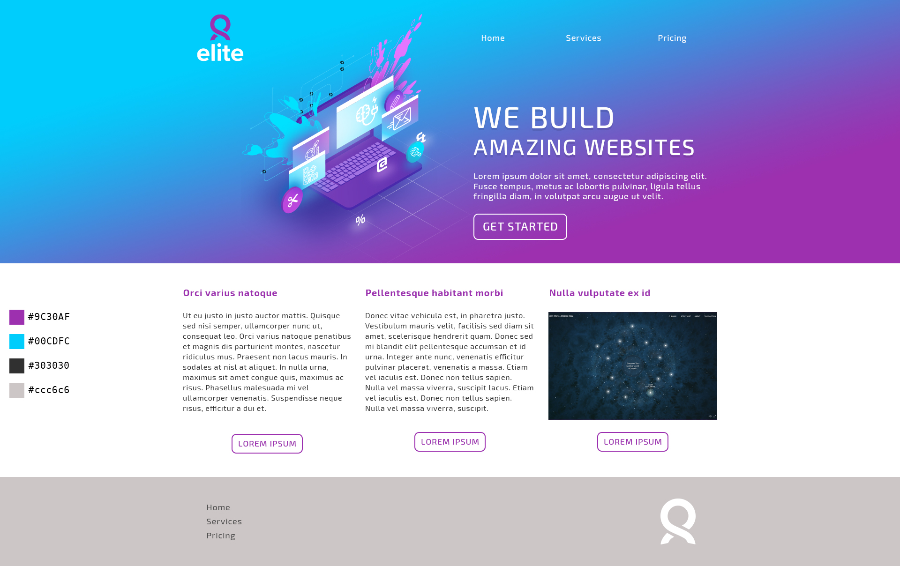

ekyna-learn/html-css-agency
===

Intégration HTML/CSS d'un site internet : agence de communication.

### Accueil

Fichier __index.html__.

[Version annotée](doc/01-home-annotated.jpg)

### Services

Fichier __services.html__.

<!-- [Version annotée](doc/02-gallery-annotated.jpg)-->

### Pricing

Fichier __pricing.html__.

<!-- [Version annotée](doc/03-contact-annotated.jpg) -->
